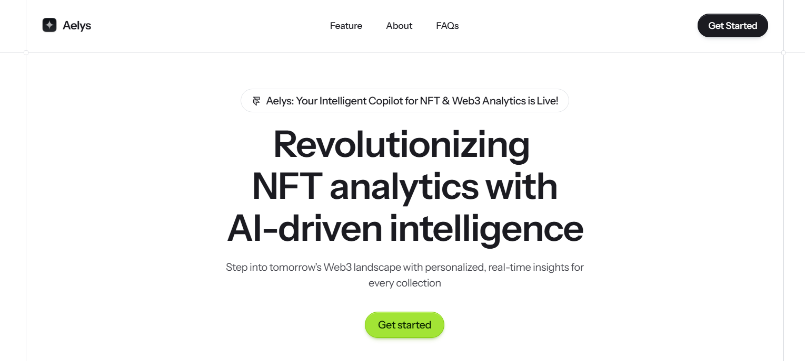

# **Aelys Copilot | Powered by bitsCrunch APIs**

*Revolutionizing NFT analytics with AI-driven intelligence and real-time Web3 insights*

---

## 📖 Overview

Aelys Copilot is a next-generation NFT and crypto analytics platform, built as an AI-powered conversational copilot for both individual portfolio owners and data-driven market analysts. Leveraging OpenAI’s large language models together with bitsCrunch UnleashNFTs APIs, Aelys enables trusted, user-friendly chat interactions, personalized wallet analysis, and market research—instantly and securely.

Aelys was developed as a showcase entry for the bitsCrunch x AI Builders Hack 2025 by Developer: Nikhil Raikwar.

## Features

### 🚀 Aelys Copilot – NFT Portfolio Intelligence

- **Personal NFT & Crypto Portfolio Assistant:**
  Understand, track, and analyze your Web3 portfolio, DeFi holdings, and NFT assets.

- **Wallet & Risk Analysis:**
  Instant breakdowns of token balances, NFT value, wallet reputation, and activity trends.

- **Fraud & Wash Trade Detection:**
  Detect suspicious transactions and get alerts on wallet health or anomalies.

- **Conversational Interface:**
  Simply ask any question about your portfolio to get live data, natural explanations, and even risk warnings—all in a private, chat-based flow.

**Key UnleashNFTs APIs Used:**

- `/wallet/balance/defi` — DeFi portfolio breakdown
- `/wallet/balance/nft` — NFT portfolio overview
- `/wallet/balance/token` — ERC20/token holdings
- `/wallet-label` — Wallet label & status
- `/wallet-score` — Wallet risk/reputation scoring
- `/wallet-metrics` — Metrics, activity, and P&L
- `/nft-wallet-analytics` — NFT-specific wallet analytics
- `/nft-wallet-washtrade` — Wallet-level fraud detection
- `/nft-wallet-profile` — Detailed wallet profile

### 📊 Market Alpha Copilot – NFT Market Insight

- **Market Trend Explorer:**
  Get comprehensive trend charts, volume metrics, and aggregated market health.

- **Traders, Holders, Washtrading Reports:**
  Analyze live metrics for active traders, whales, holders, and market manipulation/wash trading.

- **Easy, Visual Answers:**
  When you ask about trends, see Area Charts and time-series analytics rendered instantly in the chat.

**Key UnleashNFTs APIs Used:**

- `/nft/market-insights/analytics` — Market-wide NFT analytics (volume, sales, transactions)
- `/nft/market-insights/holders` — NFT holders’ aggregation and trends
- `/nft/market-insights/scores` — Market-level score trends
- `/nft/market-insights/traders` — Trader activity analytics
- `/nft/market-insights/washtrade` — Wash trade metrics over time

### 🤖 Unified AI Agents (OpenAI x bitsCrunch)

Both copilots are powered by OpenAI LLMs for smart query understanding, answer generation, and education/explanation of NFT and crypto concepts.

Seamlessly route both general crypto/NFT questions and data-driven analytics to the correct API, merging conversational strengths with hard data.

Automatically use your connected wallet address, or allow wallet address overrides per query.

Multilingual and context-aware responses for all users.

## Technology Stack

- **Landing Page:** Framer ([Live Demo](https://aelys.framer.ai))
- **Frontend:** Next.js, React, Tailwind CSS
- **Chat Integration:** OpenAI API (GPT LLMs)
- **Blockchain Analytics:** bitsCrunch UnleashNFTs APIs
- **UI Frameworks:** shadcn/ui, Magic UI
- **Visuals:** Spline animation for hero/branding

## Example Queries to Try

**Aelys Copilot**

- What’s my NFT portfolio worth right now?
- Show my DeFi holdings breakdown.
- How is my wallet’s risk score trending?
- Are there any wash trades or suspicious transactions in my wallet?
- Compare my trading activity to top wallet traders.
- What ERC20 tokens do I own?
- Explain my NFT collection composition.

**Market Alpha Copilot**

- Show me NFT market volume trends for the past week.
- Which blockchain had the highest number of new holders?
- What’s the current level of wash trading in the NFT market?
- Summarize active trader trends on Polygon.
- Display NFT market risk scores for the last 30 days.
- What are the daily changes in sales volume this month?

## Why Aelys Copilot Stands Out

- 🤝 **Unified General + Data Intelligence:**
  Handles both real-time live analytics and all your NFT/crypto general questions in one chat.

- 🔮 **Instant Visuals:**
  See your data as trendlines, risk cards, or summary charts—no dashboards required.

- 🛡️ **Security by Design:**
  All portfolio analysis is private; only you see your wallet data and risk scores.

- 🧠 **OpenAI × bitsCrunch:**
  The best of generative AI and market analytics, merged for next-gen user experience.

- **Built for:** bitsCrunch x AI Builders Hack 2025
- **Developer:** Nikhil Raikwar
